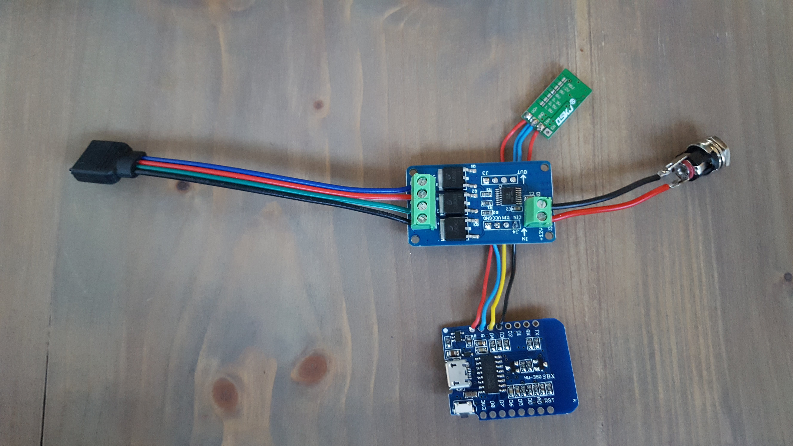
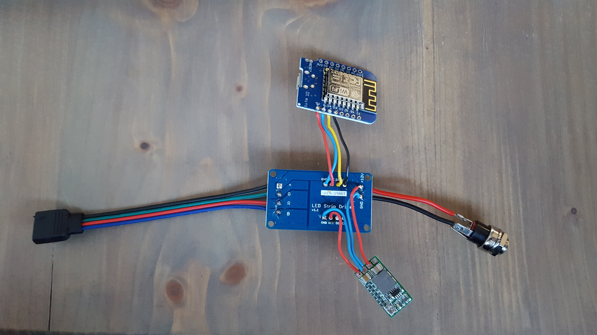

# HomeyDuino Led Strip Driver

## 1. Introduction
With this example you can create your own HUE lamp controlled by Homey. It gives you the possibility to change color, brightness and saturation.

## 2. Parts
* [WeMos D1 mini V2](https://nl.aliexpress.com/wholesale?catId=0&initiative_id=SB_20180102232002&SearchText=WeMos+D1+mini+V2)
* [RGB Led Strip Driver module](https://nl.aliexpress.com/wholesale?catId=0&initiative_id=SB_20180102231858&SearchText=RGB+Led+Strip+Driver+module)  
  <i>this shield is based on the P9813 chip</i>
* [DC/DC converter](https://nl.aliexpress.com/wholesale?catId=0&initiative_id=SB_20180102232329&SearchText=DC+DC+Step+Down+Buck+Converter)  
  <i>the leds works on 12 volt but the WeMos needs 5 volt. 500mA is more than enough</i>
* [12v DC wall-plug adapter](https://nl.aliexpress.com/wholesale?catId=0&initiative_id=SB_20180102234456&SearchText=12+volt+power+supply)  
  <i>The power (amperes) you need depending on the amount of LEDs.</i>
* [RGB ledstrip](https://nl.aliexpress.com/wholesale?catId=0&initiative_id=SB_20180102234421&SearchText=led+strip+SMD+5050)  
  <i>Use RGB led stript, not the RGBW.</i>

Optional part
* [Wemos relais shield](https://nl.aliexpress.com/wholesale?catId=0&initiative_id=SB_20180107000934&SearchText=wemos+relais+shield) 
  <i>If you have 12 volt lighting that you want to turn on immediately when you switch on the RGB LED strip you can connect an extra relais to the Wemos by an relais shield. If you want to use something else like a Arduino relais shield watch out for the voltage because the Wemos runs on 3.3 volt.</i>

## 3. Software
For this project you need to add the following libraries.
* ESP8266WiFi.h  
  <i>WeMos is based on the ESP8266 chip, therefor you need this library.</i>
* WiFiClient.h  
  <i>We use the Wemos as a client, Homey is the master.</i>
* [Homey.h](https://github.com/athombv/homey-arduino-library)  
  <i>The Homey library of course.</i>
* [ChainableLED.h]( https://github.com/pjpmarques/ChainableLED)  
  <i>we use this one for contolling the P9813 led driver chip.</i>

## 4. Connecting all the parts
* Connect the 12+ of the powersupply to the LED shield +12V and to the IN+ of the DC/DC converter.
* Connect the GND of the powersupply to the LED shield GND and to the GND of the DC/DC converter.
* Now you need to put power to the powersupply and adjust the DC/DC converter to 5 volt on the VO+ connetor. 
Of course you can also use an DC/DC converter with an default 5 volt output.
* Disconnect the power.
* Connect the VO+ of the DC/DC converter to the VCC of the LED shield and to the 5V of the Wemos.
* Connect the GND of the DC/DC converter to the GND of the LED shield and to the GND (G) of the Wemos.
* Connect the D3 of the Wemos to the Cin of the LED shield.
* Connect the D4 of the Wemos to the Din of the LED shield.

<strong>Optional</strong>
If you want to control other lights like an 12 volt christmas light you can use an Arduino Relais shield. 
When turn on the RGB led strip from Homey, than automaticaly the relais will switch.
For that:
* Connect the VO+ (5volt) of the DC/DC converter to the relais shield.
* Connect then GND of the DC/DC converter to the relais shield.
* Connect the D1 of the Wemos to the Din of the relais shield.

| Wemos pin   | Description                                                             |
|-------------|-------------------------------------------------------------------------|
| 5V          | 5 volt from DC/DC converter (VO+)                                       |
| GND (G)     | GND from DC/DC converter (GND)                                          |
| D1          | Optional to relias shield                                               |
| D3          | Cin of LED shield => clock input                                        |
| D4          | Din of LED shield => data input                                         |

