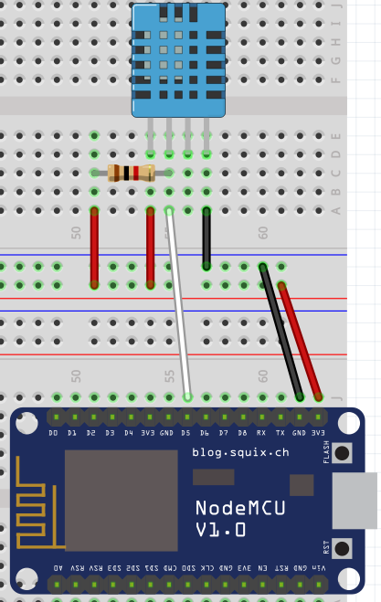

# Using Homey capabilities with Homeyduino: sensor example

This project demonstrates how to send the measurements collected by a DHT11 temperature and humidity sensor to Homey using a NodeMCU board and Homeyduino.

Except for the ESP8266 specific WiFi code the sketch can be used on any Homeyduino compatible Arduino platform.

# 1. Used hardware
 * A NodeMCU 1.0 board (ESP8266 based) (any other board would work as well)
 * A DHT11 sensor
 * A 1kOhm resistor

# 2. Building the hardware


 

# 3. The basic sketch

The basics for making this project work are the getting-started sketch for the esp8266 combined with the "SimpleDHT" Arduino library for using the DHT11 sensor.

```cpp
#include <ESP8266WiFi.h>
#include <WiFiClient.h>
#include <Homey.h>
#include <SimpleDHT.h>

#define PIN_DHT D5

SimpleDHT11 dht11;

unsigned long previousMillis = 0;
const unsigned long interval = 10000; //Interval in milliseconds

void wifi() {
  if (WiFi.status() != WL_CONNECTED) {
    WiFi.begin("<SSID>", "<PASSWORD>");
    uint8_t timeout = 30;
    while (WiFi.status() != WL_CONNECTED) {
      delay(500);
      Serial.print(".");
      if (timeout<1) break;
    }
    if (WiFi.status() == WL_CONNECTED) {
      //Print IP address
      Serial.print("Connected to WiFi! (");
      Serial.print(WiFi.localIP());
      Serial.println(")");
    }
  }
}

void setup() {
  Serial.begin(115200);
  Homey.begin("DHT11 sensor");
}

void loop() {
  wifi();
  Homey.loop();
  unsigned long currentMillis = millis();
  if(currentMillis - previousMillis > interval) {
    previousMillis = currentMillis;
    updateSensor();
  }
}

void updateSensor() {
  byte temperature = 0;
  byte humidity = 0;
  int err = SimpleDHTErrSuccess;
  if ((err = dht11.read(PIN_DHT, &temperature, &humidity, NULL)) != SimpleDHTErrSuccess) {
    Serial.print("Read DHT11 failed, err="); Serial.println(err);
    return;
  }

  Serial.print((int)temperature); Serial.print(" *C, ");
  Serial.print((int)humidity); Serial.println(" H");

  Homey.trigger("temperature", (int) temperature);
  Homey.trigger("humidity", (int) humidity);
}

```

# 4. Using capabilities
Even though the sketch above "works" it only uses the measurements to trigger flows. In order to be able to use Homey Insights and the temperature and humidity flowcards we must tell Homey that our triggers are capabilities.

Homey supports a predefined set of capabilities found [here](https://apps.developer.athom.com/tutorial-Drivers-Reference.html). For temperature the capability is ```measure_temperature``` and for humidity the capability is ```measure_temperature```.

Telling Homey that our device has these capabilities is as simple as adding the following lines to the ```setup()``` function:

```cpp
Homey.addCapability("measure_humidity");
Homey.addCapability("measure_temperature");
```

Note that these capabilities can only be published by the device and not set by Homey, so we don't need to set a callback function.

To update the value of these capabilities you can just replace the ```trigger``` function used to send the new value to Homey with the ```setCapabilityValue``` function.

This makes the trigger lines in the ```updateSensor()``` function look as follows:

```cpp
Homey.setCapabilityValue("measure_temperature", (int) temperature);
Homey.setCapabilityValue("measure_humidity", (int) humidity);
```

To make Homey see these capabilities you need to remove the device from Homey and pair with it again, for capabilities can not be changed once a device has been paired.

# 5. Setting the device class
Even though Homey nows about the capabilities it still does not know what kind of device it it. Some device classes enable special features for interacting with the device.

To set the device class of your device the ```setClass``` function is used. A list of available device classes can be found [here](https://apps.developer.athom.com/tutorial-Drivers-Reference.html).

The device built in this example is a sensor, so the device class can be set to be ```sensor``` by adding the following line to ```setup()```:
```cpp
  Homey.setClass("sensor");
```
