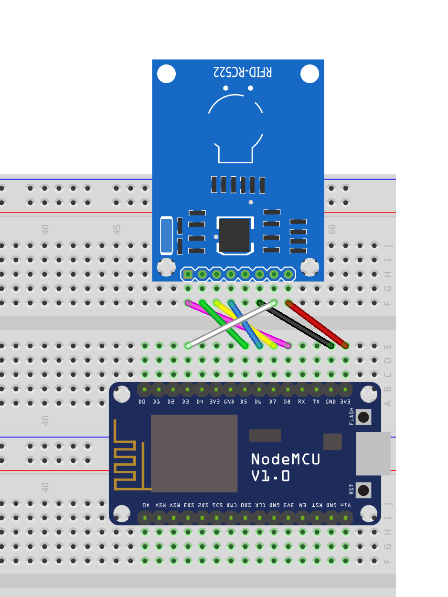
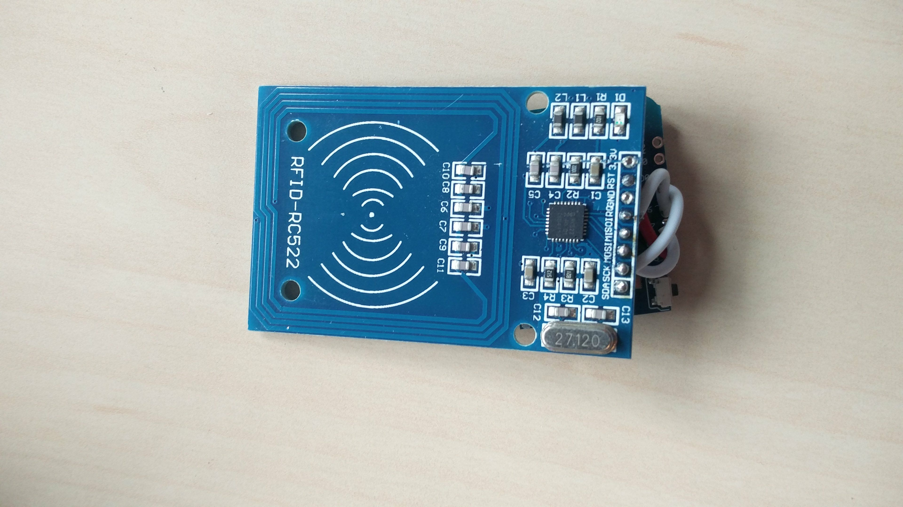
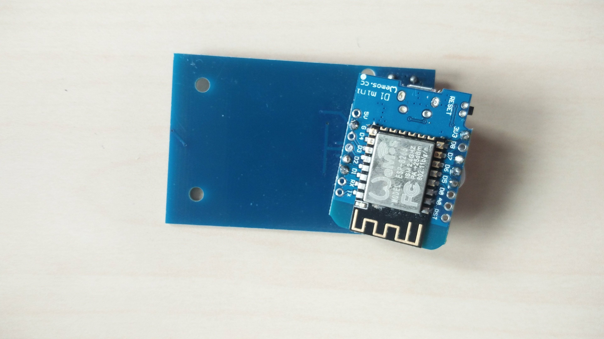
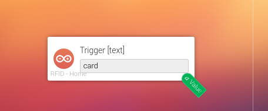

# A NFC/RFID reader

## 1. Introduction
Homey can read NFC cards like your public transport card. This feature has a lot of potential applications. But for many of those applications having to physically touch your NFC card to your Homey can make implementing your NFC ideas a bit of a hassle.

Using Homeyduino you can now easily make your own NFC readers that work with Homey, removing the issue of having to be physically near Homey and allowing you to place NFC readers where ever you want.

# 2. Required hardware
For this project we've used:
* A NodeMCU ESP8266 board (Any other ESP8266 board with the SPI pins broken out can be used)
* [A RFID-RC522 module](https://www.aliexpress.com/wholesale?SearchText=RFID-RC522)
* A breadboard
* Prototyping wires

# 3. Building the prototype

This project used only two modules which are connected to each other: the NodeMCU board and the RFID-RC522 board. The following table and Fritzing diagram show how the two are connected.



| Pin on RFID-RC522 | Pin on NodeMCU    | Label | Function                | Color in diagram |
|-------------------|-------------------|-------|-------------------------|------------------|
| 1                 | D8                | SDA   | SPI Chip select         | Purple           |
| 2                 | D5                | SCL   | SPI Clock               | Green            |
| 3                 | D7                | MOSI  | SPI Master Out Slave In | Yellow           |
| 4                 | D6                | MISO  | SPI Master In Slave Out | Blue             |
| 5                 | Not connected     | IRQ   | Interrupt               |                  |
| 6                 | GND               | GND   | Ground                  | Black            |
| 7                 | D3                | RST   | Reset                   | White            |
| 8                 | 3V3               | 3.3V  | Power in 3.3v           | Red              |

This is what our prototype looks like:


# 4. The software

## Requirements
Make sure you have the following programs installed:
* The Arduino IDE
* ESP8266 support for Arduino IDE
* MFRC522 library by Adafruit (Available from the library manager)
* The Homeyduino Arduino library

## The sketch
```cpp
#include <ESP8266WiFi.h>
#include <WiFiClient.h>
#include <Homey.h>
#include <SPI.h>
#include "MFRC522.h"

/* PIN CONFIG */
#define MFRC522_RESET D3
#define MFRC522_SS    D8

/* OBJECTS */
MFRC522 mfrc522(MFRC522_SS, MFRC522_RESET);

/* GLOBAL VARIABLES */

unsigned long previousMillis = 0;
const unsigned long interval = 100; //Interval in milliseconds
String oldCardId = "";
uint8_t timeout = 0;

void wifi() {
  if (WiFi.status() != WL_CONNECTED) {
    WiFi.begin("<SSID>", "<PASSWORD>");
    uint8_t timeout = 30;
    while (WiFi.status() != WL_CONNECTED) {
      delay(500);
      Serial.print(".");
      if (timeout<1) break;
    }
    if (WiFi.status() == WL_CONNECTED) {
      //Print IP address
      Serial.print("Connected to WiFi! (");
      Serial.print(WiFi.localIP());
      Serial.println(")");
    }
  }
}

//Arduino functions
void setup() {
  Serial.begin(115200);
  Homey.begin("RFID");
  Homey.setClass("sensor");
  SPI.begin();
  mfrc522.PCD_Init();
}

void loop() {
  wifi();
  Homey.loop();

  unsigned long currentMillis = millis();
  if(currentMillis - previousMillis > interval) {
    previousMillis = currentMillis;
    if ( mfrc522.PICC_IsNewCardPresent() ) {
      mfrc522.PICC_ReadCardSerial();
      String cardId = "";
      for (uint8_t i = 0; i<mfrc522.uid.size; i++) {
        if (mfrc522.uid.uidByte[i]<0x10) cardId += "0";
        cardId += String(mfrc522.uid.uidByte[i], HEX);
      }
      if (cardId!=oldCardId) { //Check if we didn't already see this card
        oldCardId = cardId; //Store the card id
        Serial.println(cardId); //Print the card id to the serial monitor
        Homey.trigger("card", cardId); //Send the card id to Homey
        timeout=50; //Allow the same card to be seen again after 5 seconds (50*100ms)
      }
    } else {
      if (timeout>0) {
        timeout--;
        if (timeout==0) oldCardId=""; //Remove previous card ID
      }
    }
  }
}
```

Before flashing this sketch to your NodeMCU board make sure that you have set the board type to "NodeMCU 1.0", otherwise the sketch will not compile due to missing definitions for the D3 and D8 pins.

# 5. Making it smaller

After we made sure everything works as expected we made the project smaller by taking away the breadboard: we soldered the RFID-RC522 module to a Wemos D1 mini, giving us a small device that we could easily mount inside an enclosure.




#6. The Homey flowcard
The identification numer of a compatible RFID card will be sent to homey as a text string. By adding the "Action [text]" flowcard of the device to your flow and selecting the "card" trigger your flow will be triggered whenever a card is scanned. The autocomplete field will only show the "card" trigger once a card has been succesfully scanned at least once. If it is not shown (yet) you can always type in the name of the trigger manually.


